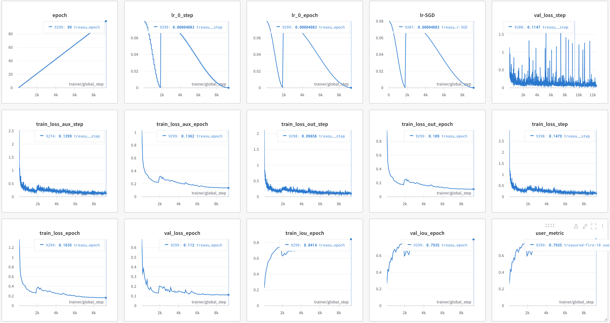

# The implementation of DeeplabV3Plus with Pytorch

The training process of deeplabv3+ with resnet101 as backbone on Cityscapes dataset. The mIoU on validation set of Cityscape is 0.7935.





```
2022-12-26 00:27:23,450 - DeepModel - INFO - road           , iou: 0.9847 | precision: 0.8083 | recall: 0.9911
2022-12-26 00:27:23,450 - DeepModel - INFO - sidewalk       , iou: 0.8701 | precision: 0.7658 | recall: 0.9372
2022-12-26 00:27:23,451 - DeepModel - INFO - building       , iou: 0.9301 | precision: 0.8690 | recall: 0.9669
2022-12-26 00:27:23,451 - DeepModel - INFO - wall           , iou: 0.5350 | precision: 0.6549 | recall: 0.6020
2022-12-26 00:27:23,451 - DeepModel - INFO - fence          , iou: 0.6345 | precision: 0.6429 | recall: 0.7327
2022-12-26 00:27:23,451 - DeepModel - INFO - pole           , iou: 0.6807 | precision: 0.7092 | recall: 0.7956
2022-12-26 00:27:23,452 - DeepModel - INFO - traffic light  , iou: 0.7292 | precision: 0.7622 | recall: 0.8399
2022-12-26 00:27:23,452 - DeepModel - INFO - traffic sign   , iou: 0.8051 | precision: 0.7601 | recall: 0.8715
2022-12-26 00:27:23,452 - DeepModel - INFO - vegetation     , iou: 0.9275 | precision: 0.9217 | recall: 0.9697
2022-12-26 00:27:23,452 - DeepModel - INFO - terrain        , iou: 0.6488 | precision: 0.7447 | recall: 0.7285
2022-12-26 00:27:23,452 - DeepModel - INFO - sky            , iou: 0.9495 | precision: 0.8972 | recall: 0.9816
2022-12-26 00:27:23,453 - DeepModel - INFO - person         , iou: 0.8335 | precision: 0.8285 | recall: 0.9237
2022-12-26 00:27:23,453 - DeepModel - INFO - rider          , iou: 0.6433 | precision: 0.7597 | recall: 0.7862
2022-12-26 00:27:23,453 - DeepModel - INFO - car            , iou: 0.9561 | precision: 0.9390 | recall: 0.9787
2022-12-26 00:27:23,453 - DeepModel - INFO - truck          , iou: 0.8351 | precision: 0.6755 | recall: 0.9195
2022-12-26 00:27:23,453 - DeepModel - INFO - bus            , iou: 0.8807 | precision: 0.8918 | recall: 0.9373
2022-12-26 00:27:23,454 - DeepModel - INFO - train          , iou: 0.7528 | precision: 0.8593 | recall: 0.7774
2022-12-26 00:27:23,454 - DeepModel - INFO - motorcycle     , iou: 0.6856 | precision: 0.6890 | recall: 0.8076
2022-12-26 00:27:23,454 - DeepModel - INFO - bicycle        , iou: 0.7865 | precision: 0.8006 | recall: 0.8900
2022-12-26 00:27:23,454 - DeepModel - INFO - iou_mean: 0.7935
2022-12-26 00:27:23,454 - DeepModel - INFO - precision_mean: 0.7884

```
